# DNL k-mers on EH23b

Since EH23b is a scaffolded assembly, DNL k-mers are anchored directly to their chromosomal loci. In this dataset the DNL k-mers are clustered in 8 broad loci and 9 narrow loci on chromosomes 1, 2, 6, 7, 8, X.

Find bedgraph and bigwig files for the browser tracks shown here at:
```
s3://salk-tm-shared/csat/day-neutral/DNL_kmers_bdg.tar.gz
s3://salk-tm-shared/csat/day-neutral/DNL_kmers_bw.tar.gz
```

Broad loci include a high density of DNL k-mers spanning a region smaller than 3 Mb. Narrow loci include all other loci with at least 1 DNL k-mer. The narrow loci observed here all span a region smaller than 3 Mb.

## Broad loci
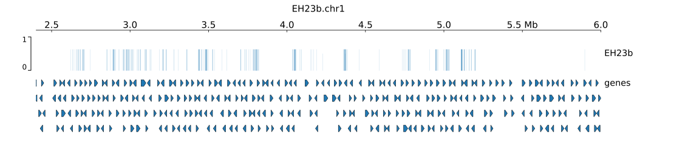
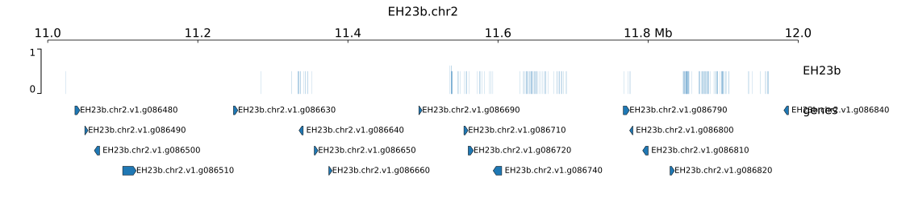
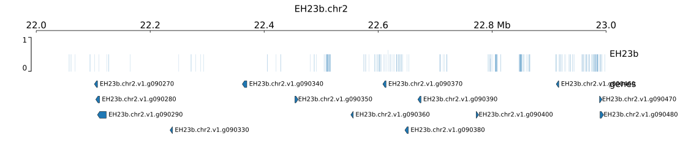
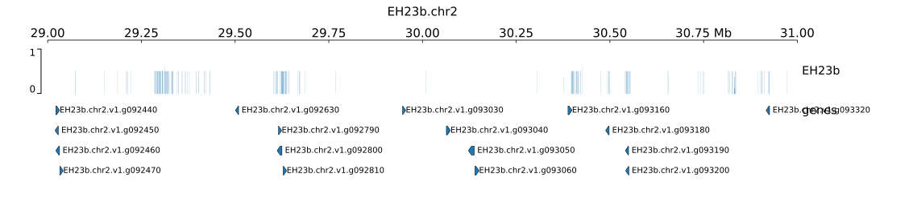
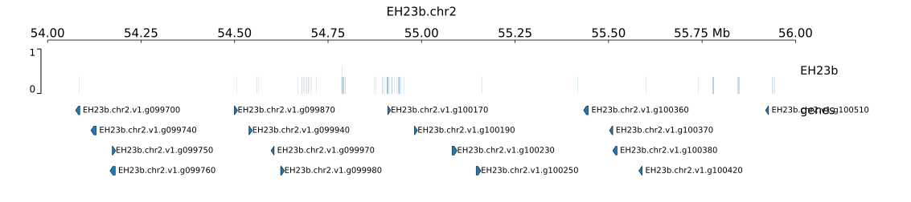
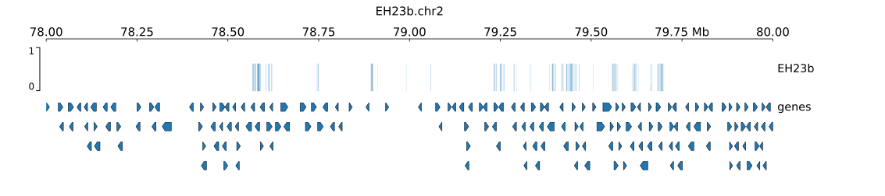
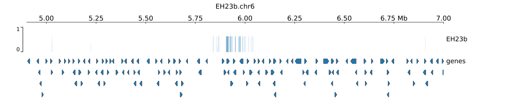
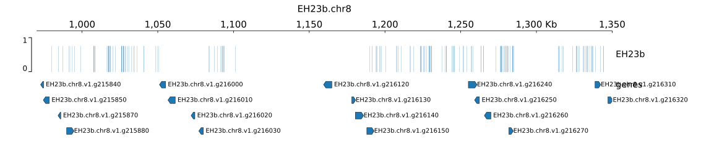

## Narrow loci
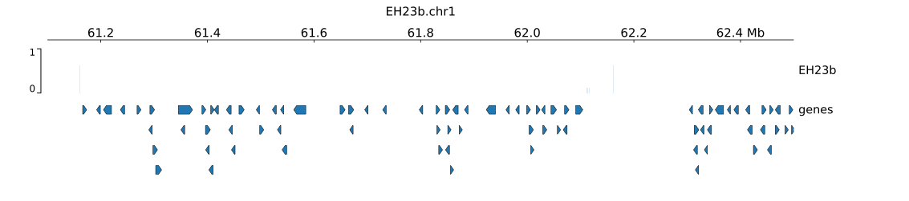
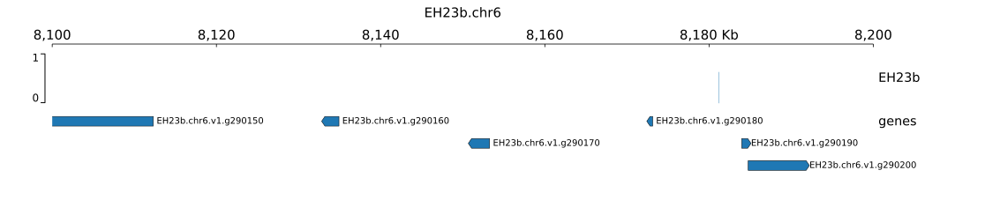
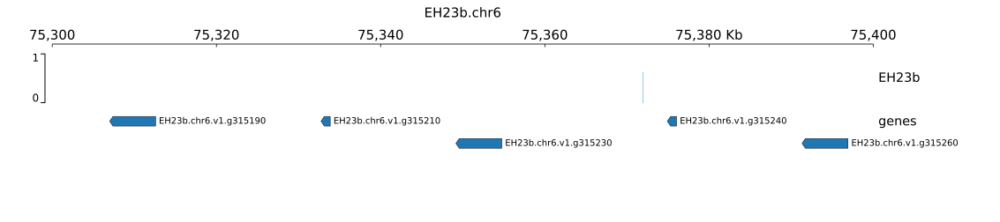
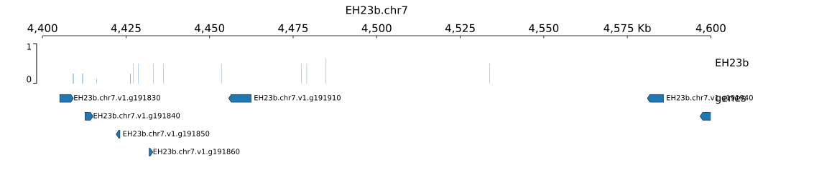
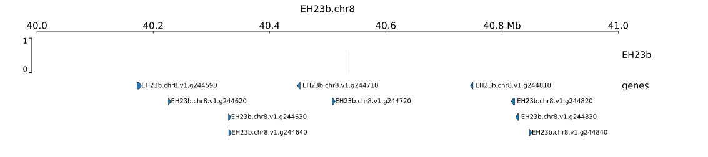
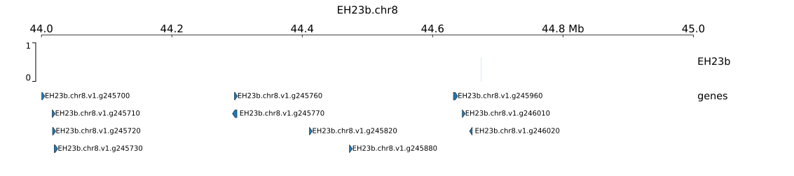
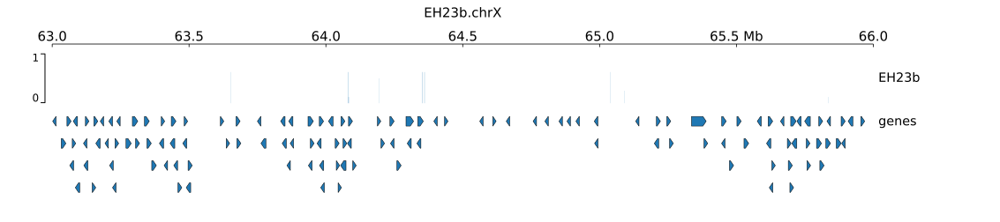
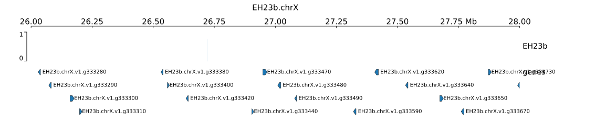
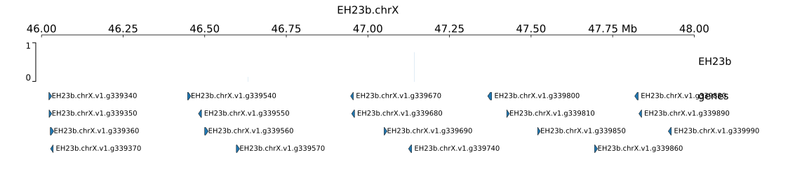
