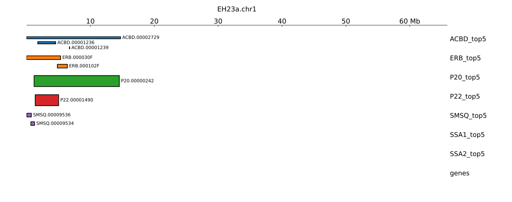
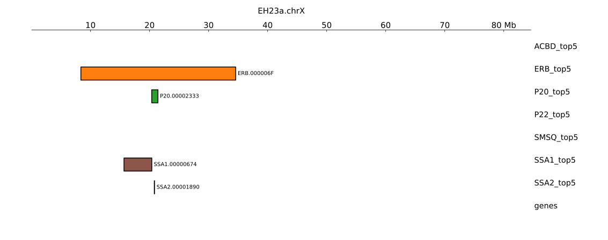
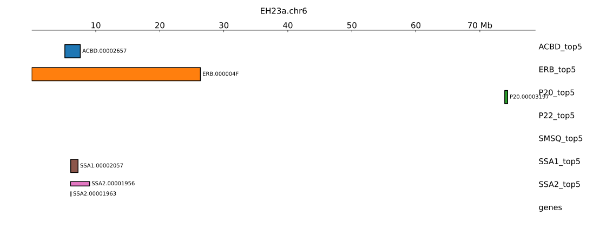
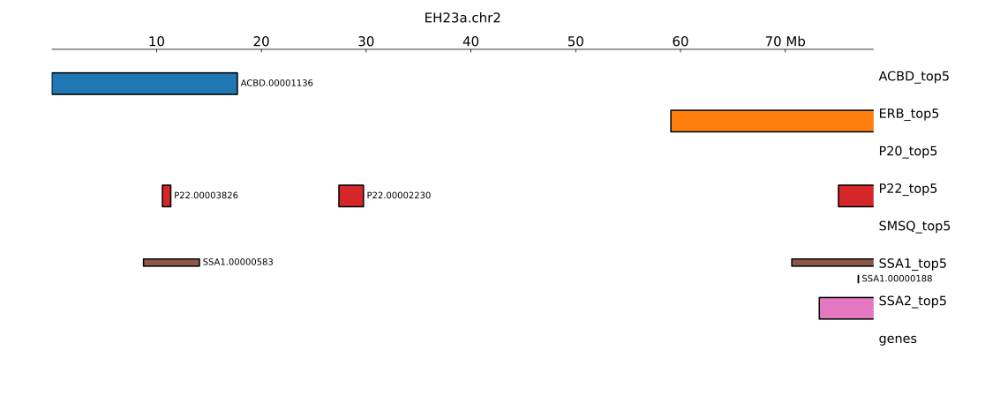

# Localizing day-neutral k-mers to EH23a/b

Below, _DNL k-mers_ refers to the set of k-mers present in at least 5 of the 8 day-neutral (DNL) genomes (ACBD, EH23b, ERB, P20, P22, SMSQ, SSA1, SSA2), but absent from all other cannabis genomes in the current pangenome

Below are details of identifying day-neutral contigs with dense clusters of DNL k-mers,
then localizing contigs to chromosomes of EH23a. The results are not yet comprehensive (only top 5 contigs from each DNL genome are shown), but they provide useful context and illustrate the most obvious characteristics of DNL k-mers.

The results of this dataset are broad/approximate mappgings of DNL contigs to EH23a/b chromosomes. For more fine localization of k-mers at specific loci, refer to the browser tracks found at:
```
s3://salk-tm-shared/csat/day-neutral/DNL_kmers_bdg.tar.gz
s3://salk-tm-shared/csat/day-neutral/DNL_kmers_bw.tar.gz
```

## Alignments
The alignment files mapping day-neutral (DNL) contigs to EH23a aren't included here but are found on AWS at:
```
s3://salk-tm-shared/csat/day-neutral/EH23axDNL.tar.gz
s3://salk-tm-shared/csat/day-neutral/EH23bxDNL.tar.gz
```

## Data
```
day-neutral/
  chromsizes/
    *.chromsizes
  kmers/
    *.kmers
  EH23a_mapping/
    *.tsv
    *_top9.tsv
    *_top9.bed
    *.pdf
    *.svg
  EH23b_mapping/
    *.tsv
    *_top9.tsv
    *_top9.bed
    *.pdf
    *.svg
  sort_contigs.py
  approx_position.py
  README.md
```

### chromsizes
For each DNL genome, the `.chromsizes` file contains the size of each contig in BP

### kmers
For each DNL genome, the `.kmers` file contains the area in bp occupied by DNL k-mers

### EH23a/b_mapping
The `.tsv` files are, for each DNL genome, a table with a row for each contig and columns:
- **contig**: the contig ID
- **kmers_bp**: bp occupied by DNL k-mers
- **total_bp**: total size of contig
- **chrom**: EH23a chromosome matching this contig

The `_top9.tsv` files are the top 9 contigs of each `*.tsv` file, with 3 additional columns:
- **approx_start**: approximate start position of the contig's mapping to EH23a
- **approx_center**: approximate center position
- **approx_end**: approximate end position

The `.bed`, `.pdf`, and `.svg` files are used to visualize the data in the `*_top9.tsv` files, see below.

### scripts
`sort_contigs.py` contains logic used to order contigs and generate the `*.tsv` files
`approx_position.py` contains logic used to generate approx coordinates for contigs in `*_top9.tsv` files

## EH23a Results

Across several DNL genomes there are signals mapping to EH23a.chr1 around 5 Mb


On EH23a.chrX around 20 Mb.


On EH23a.chr6 around 6 Mb:


Multiple loci on EH23a.chr2


## EH23b Results

Similar to EH23a

chr1


chrX


chr6


chr2
