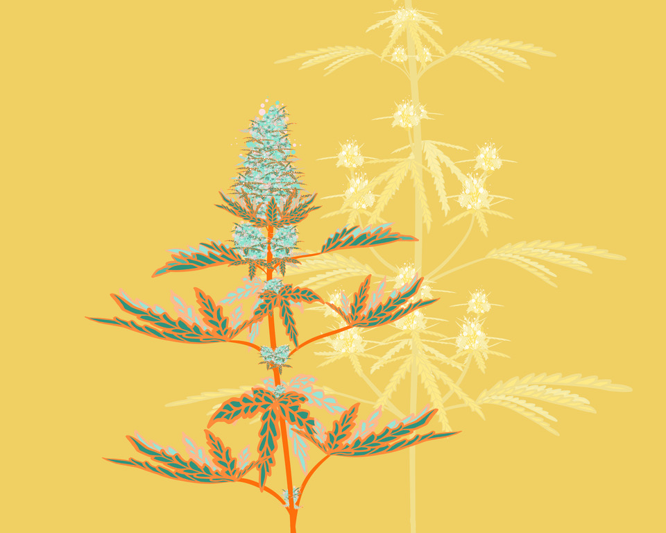

# Domesticated cannabinoid synthases amid a wild mosaic cannabis pangenome

Cannabis sativa is a globally significant seed-oil, fiber, and drug-producing plant species. However, a century of prohibition has severely restricted legal breeding and germplasm resource development, leaving potential hemp-based nutritional and fiber applications unrealized. Existing cultivars are highly heterozygous and lack competitiveness in the overall fiber and grain markets, relegating hemp to less than 200,000 hectares globally1. The relaxation of drug laws in recent decades has generated widespread interest in expanding and reincorporating cannabis into agricultural systems, but progress has been impeded by the limited understanding of genomics and breeding potential. No studies to-date have examined the genomic diversity and evolution of cannabis populations using haplotype-resolved, chromosome-scale assemblies from publicly available germplasm. Here we present a cannabis pangenome, constructed with 181 new and 12 previously released genomes from a total of 144 biological samples including both male (XY) and female (XX) plants, which resulted in 42 trio-phased and 36 haplotype-resolved, chromosome-scale assemblies. We discovered widespread regions of the cannabis pangenome that are surprisingly diverse for a single species, with high levels of genetic and structural variation, and propose a novel population structure and hybridization history. Across the ancient heteromorphic XY sex chromosomes, we observed a variable boundary at the sex-determining region (SDR) and pseudoautosomal region (PAR, and identified over 7,000 genes with biased expression in male flowers, including several key flowering regulators. Conversely, the cannabinoid synthase genes, responsible for producing CBDA and THCA, contained very low levels of diversity, despite being embedded within a variable region containing multiple pseudogenized paralogs, structural variation and distinct transposable element arrangements. Additionally, we identified variants of acyl-lipid thioesterase (ALT) genes 2 that were associated with fatty acid chain length variation and the production of the rare cannabinoids, tetrahydrocannabivarin (THCV) and cannabidivarin (CBDV). We conclude the Cannabis sativa gene pool remains only partially characterized, and that the existence of wild relatives in Asia is likely, while its potential as a crop species remains largely unrealized.

**Preprint:** https://www.biorxiv.org/content/10.1101/2024.05.21.595196v1




## Resources

**Michael lab genomic resources:** https://resources.michael.salk.edu/root/home.html

**Scaffolded and unscaffolded genomes and annotations, figshare:** https://doi.org/10.25452/figshare.plus.c.7248427.v1

**Scaffolded genomes and annotations; supplementary materials, figshare:** https://figshare.com/projects/Cannabis_Pangenome/205555


## Figure materials

### Cloning the project and it's submodules

Git documentation: https://git-scm.com/book/en/v2/Git-Tools-Submodules

```
git clone git@github.com:padgittl/CannabisPangenomeShared.git
cd CannabisPangenomeShared
git submodule init
git submodule update
```

<details>
<summary><h3>Fig.1. Cannabis pangenome architecture uncovers at least five distinct populations.</h3></summary>
Seven panels: A-G<br>
A. ViningLab/CannabisPangenome/Fig1A_SynChrom/Ideo_plot.Rmd<br>
C, D. CollectOrthogroups/README.md and CountOrthogroups/README.md<br>
E. padgitt/CannabisPangenomeAnalyses/CoreDispensableGenes/README.md<br> 
</details>

<details>   
<summary><h3>Fig.2. Transposable elements shape the cannabis pangenome.</h3></summary>
Twelve panels: A-L<br>
padgittl/CannabisPangenomeTransposableElements/README.md<br>
</details>

<details>
<summary><h3>Fig.3. Structural variants occur at different frequencies in populations and are non-randomly distributed across the genome.</h3></summary>
Four panels: Panels A-D<br>
</details>

<details>
<summary><h3>Fig.4. The cannabinoid pathway is domesticated yet, but shows contrasting patterns of genetic diversity and synteny.</h3></summary>
Five panels: Panels A-E<br>
A. amamerto/cannabis_pangenome/copynumber_counting/run.count_copynumbers.sh<br>
C. amamerto/cannabis_pangenome/synthase_cassettes/run.draw_synthase_cassettes.sh<br>
D. ViningLab/CannabisPangenome/Fig5D_BUSCOchrom7/BUSCOchrom7.Rmd<br>
E. padgittl/CannabisPangenomeTransposableElements/Figure5E_teSynthaseTree/createFigure.sh<br>
</details>

<details> 
<summary><h3>Fig.5. Acyl-lipid thioesterase (ALT) gene trans duplication (TD) and diversification explains varin cannabinoid phenotype in cannabis.</h3></summary>
Panels A-F<br>
HighVarin/<br>
</details>

# Cannabis Pangenome

## GitHub repo for transposable element analysis
https://github.com/padgittl/CannabisPangenomeTransposableElements

## GitHub repo for pangenome analyses and visualizations
https://github.com/ViningLab/CannabisPangenome
