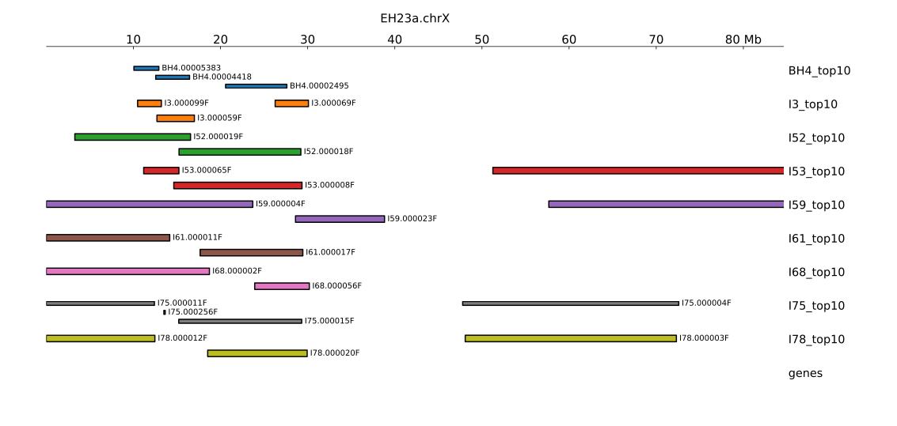
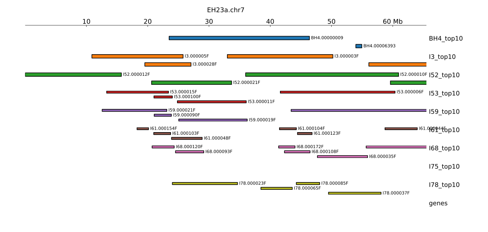
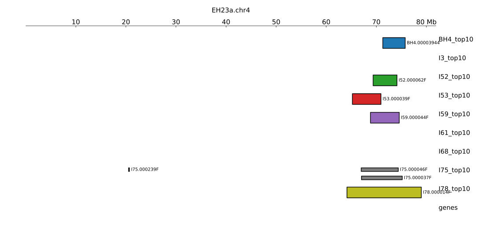
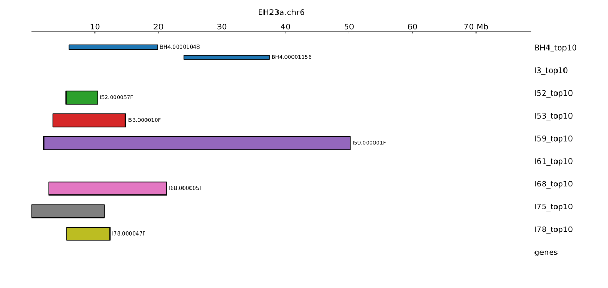

# Localizing cannabinoid-free k-mers to EH23a

Below, _CF k-mers_ refers to the set of k-mers present in all 9 cannabinoid-free (CF) genomes (BH4, I3, I52, I53, I59, I61, I68, I75, I78), but absent from all other cannabis genomes in the current pangenome

Below are details of identifying cannabinoid-free contigs with dense clusters of CF k-mers,
then localizing contigs to chromosomes of EH23a. The results are not yet comprehensive (only top 10 contigs from each CF genome are shown), provide useful context and illustrate the most obvious characteristics of CF k-mers.

The results of this dataset are broad/approximate mappgings of CF contigs to EH23a chromosomes. For more fine localization of k-mers at specific loci, refer to the browser tracks found at:
```
s3://salk-tm-shared/csat/cannabinoid-free/CF_kmers_bdg.tar.gz
s3://salk-tm-shared/csat/cannabinoid-free/CF_kmers_bw.tar.gz
```

## Alignments
The alignment files mapping cannabinoid-free (CF) contigs to EH23a aren't included here but are found on AWS at:
```
s3://salk-tm-shared/csat/cannabinoid-free/EH23axCF.tar.gz
```

## Data
```
cannabinoid-free/
  chromsizes/
    *.chromsizes
  kmers/
    *.kmers
  EH23a-mapping/
    *.tsv
    *_top10.tsv
    *_top10.bed
    *.pdf
    *.svg
  sort_contigs.py
  approx_position.py
  README.md
```

### chromsizes
For each CF genome, the `.chromsizes` file contains the size of each contig in BP

### kmers
For each CF genome, the `.kmers` file contains the area in bp occupied by CF k-mers

### EH23A-mapping
The `.tsv` files are, for each CF genome, a table with a row for each contig and columns:
- **contig**: the contig ID
- **kmers_bp**: bp occupied by CF k-mers
- **total_bp**: total size of contig
- **chrom**: EH23a chromosome matching this contig

The `_top10.tsv` files are the top 10 rows of each `*.tsv` file, with 3 additional columns:
- **approx_start**: approximate start position of the contig's mapping to EH23a
- **approx_center**: approximate center position
- **approx_end**: approximate end position

The `.bed`, `.pdf`, and `.svg` files are used to visualize the data in the `*_top10.tsv` files, see below.

### scripts
`sort_contigs.py` contains logic used to order contigs and generate the `*.tsv` files
`approx_position.py` contains logic used to generate approx coordinates for contigs in `*_top10.tsv` files

## Results

### Primary hits
Across all CF genomes there are signals mapping to EH23a.chrX, especially in the region from 10 Mb to 30 Mb. This seems to be strong support for the importance of the PT4 locus.


All CF genomes except I75 have signals mapping to EH23a.chr7.


### Secondary hits
There seem to be consistent signals in several CF genomes on EH12a.chr4 around 70 Mb:


And on chr6 around 10 Mb:

